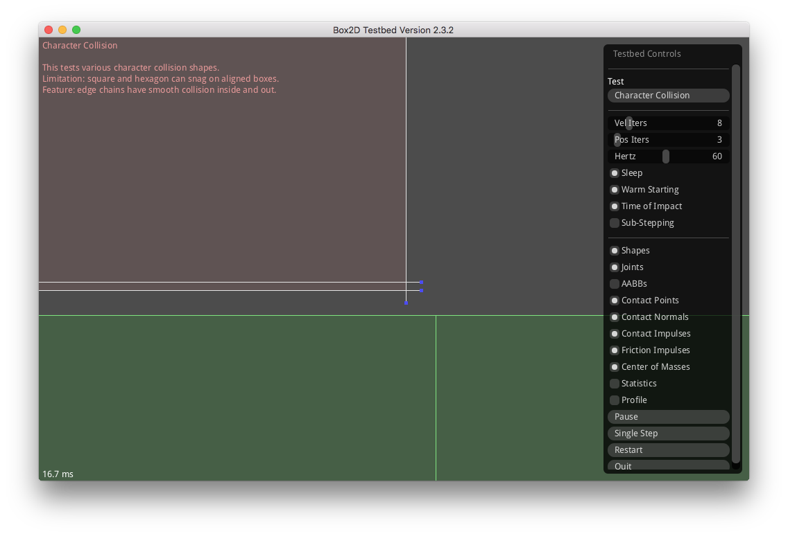

# Collision Handling

This is an initial write-up of how I've changed the collision handling.

## The Original Handling

Initially a close-up (zoomed-in) inspection of the Character Collision
Testbed test, showed this:

This has the noted effect of the top rectangle getting "stuck" at this point
when it had been dragged across the lower rectangles from the left side of the
image towards the right.

Note the **blue** dots near the center of the image
and the lines that they're connected to. These indicate the directions from
which impulses are applied. There's an upward impulse, and two impulses
applied leftward which is against the direction the top rectangle was moving.

Boom! Icky-stickiness.

## Rounded Corner Handling

As I looked into the minutia of how collisions were handled at the "skin"
scale, I realized that there was a round corner collision radius but that in
the calculations for polygons these were being treated as squared corners. See
the previously shown image for an example of this. Not satisfied with squared
off calculations, I introduced rounded corner collisions that instead look like
this (for a top rectangle dragged across the lower rectangles from the right
of the image to the left):

While rounded corner collisions aren't as simple computationally, they've been
appealing to me ever since. For one, they had the effect of reducing how much
the top rectangle would get stuck when dragged across flat aligned edges or
rectangles. For two, the rounded collision effect suggested to me that the
collision manifold calculation for two polygons could be generalized for
calculating the collision manifold for any two N-gons from an N of 1 on up.
And for three, note the blue dots and lines in this image.

There's still and upward impulse being applied. But now instead of any impulses
being applied directly against the direction of motion, the impulse is applied
at angle to the motion.

Less icky-stickiness!

## Modified Corner Handling

No stickiness at all!!

Woot!!
