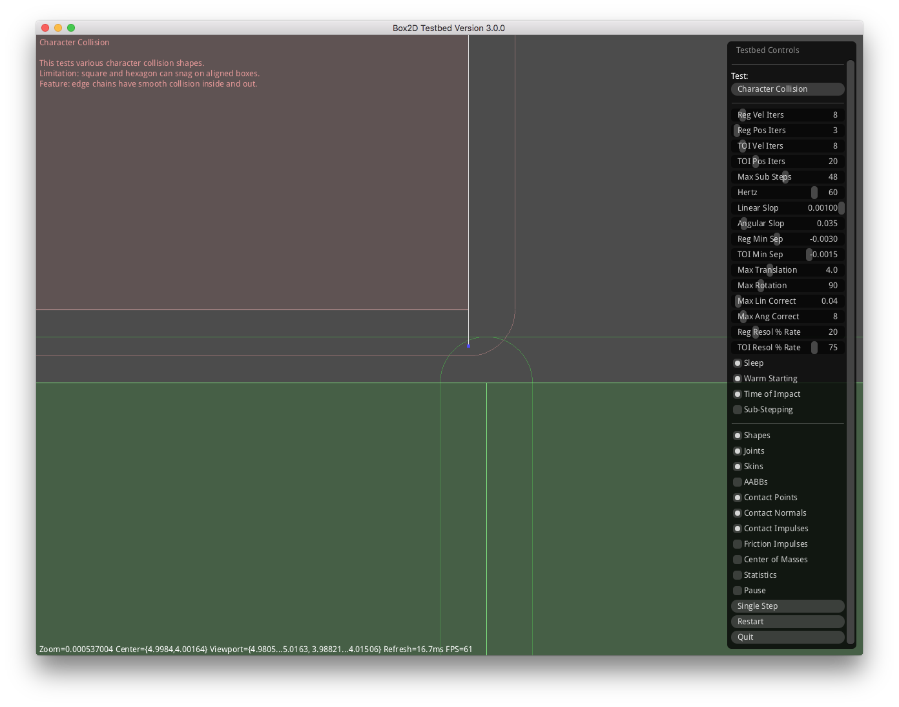

# Collision Handling

This is a write-up of how I've changed the collision handling.

## The Original Handling

In Box2D 2.3.2 (built from Erin Cato's sources), a box that comes down on top
of a flat surface made up of other boxes, that's then dragged across that
surface, sometimes gets stuck. It can be moved backward or upward, but it
basically won't move across any further in the direction it had gotten stuck
going in.

A close-up (zoomed-in) inspection of the Character Collision Testbed test of
this kind of scenario, where a box that had been dragged down onto a surface
of boxes and then dragged across it from left to right, shows the following:

Note the **blue** dots near the center of the image and the lines that they're
connected to. These indicate the directions from which impulses are applied.

The impulses are due to contacts being dealt with:
 - The contact between the upper box atop the lower box, and
 - The contact between the upper box and the lower box just to the right.
It doesn't look like these contacts are happening, but that's only because the
boxes' "skins" - padded extensions to the boxes - are actually where the
contacts are happening and these **aren't** drawn in this image.

Back to the impulses, there's:
- an upward impulse, and
- two impulses applied leftward.

The upward impulse is desirable. It's basically keeping the upper box from
falling down any further.

The leftward impulses however, they're counter to the direction the upper box
was being dragged.

Boom! Icky-stickiness.

## Rounded Corner Handling

As I looked into the minutia of how collisions were handled at the "skin"
scale, I realized that while there is a circular notion of a vertex radius at
the corners of all the shape types, for polygon-polygon collisions, these were
being treated as squared corners. The previously shown image is an example of
this. The lower-right corner of the upper box isn't seeing any impulse that's
in the direction of the upper-left corner of the lower box. Instead, it's
only seeing impulses that are in the directions of the edge normals.

Not satisfied with squared off impulse responses, I introduced rounded corner
collision handling into my fork of Box2D (like was being done for circle-circle
collisions). Rounded corner collision handling for a top rectangle dragged
across the lower rectangles from the right of the image to the left, then
instead looks like this:

Note the blue dots and lines in this image.

There's still and upward impulse being applied. But now instead of any impulses
being applied directly against the direction of motion, the impulse is applied
at an off-angle to the motion.

Less icky-stickiness!

While rounded corner collisions aren't as simple computationally, they've been
appealing to me ever since for several reasons:
 1. They had the effect of reducing how much the top rectangle would get stuck
    when dragged across flat aligned edges or rectangles.
 2. The rounded collision effect suggested to me that the collision manifold
    calculation for two polygons could be generalized for calculating the
    collision manifold for any two N-gons from an N of 1 on up.

## Modified Corner Handling

While rounded corner collisions were an improvement to me, I thought that for
polygons having much longer edges than their corner radiuses, it'd be better to
have no portion of the impulse response resisting the dragged motion at all.
I'm calling this response the modified corner handling and it results in
collision handling that now looks like this:

And now, no stickiness at all!! Woot!!
